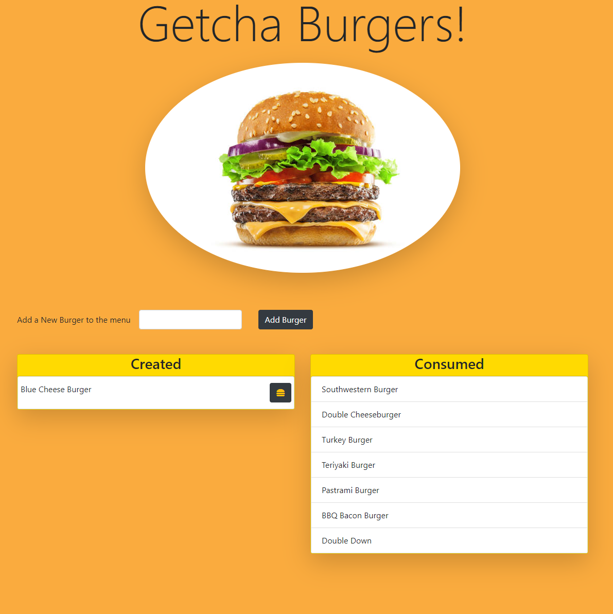

# burger-tracker   
## Description  
Add burgers to a list that you would like to eat!  Click on the hamburger icon to move them to consumed!  This app uses the mvc model to serve up html to the browser and mysql to store data in the database.
 

## Table of Contents
  * [Description](#Description)
  * [Installation](#Installation)
  * [Usage](#Usage)
  * [License](#License)
  * [Contributing](#Contributing)
  * [Test](#Tests)
  * [Questions](#Questions)
 

## Screenshot

 

## Installation
Clone the repository from github and run npm install in the root directory.
 

## Usage
Run npm run start to start a local instance and navigate to localhost:8080 in your browser.
 

## License
This application is covered under the [MIT](https://www.opensource.org/licenses) license.
 

## Contributing
Please submit any issues or pull requests to the repository on github.
 

## Tests
There are no tests currently for this app.
 

## Questions
If you have any questions, feel free to find me on github, [jburz](https://www.github.com/jburz) or send me an email at jake.bilbao.04.06@gmail.com.
  